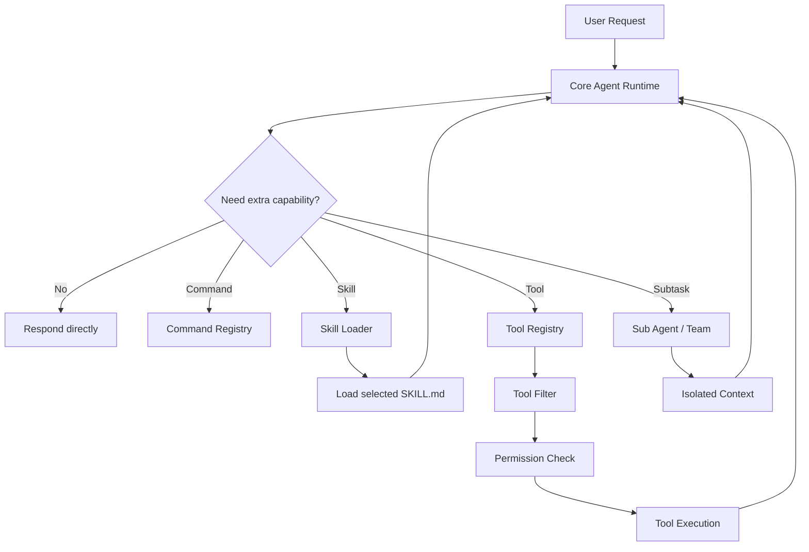
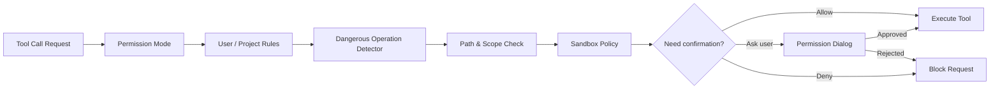
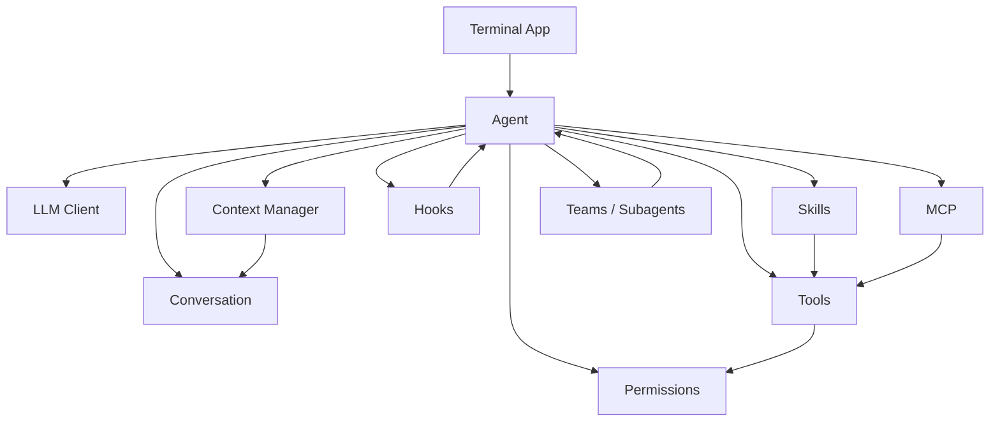

# LazyCode

LazyCode 是一个 Python 实现的终端 AI Coding Agent，用于学习和实践 Agent 工具调用、权限控制、上下文管理、技能系统和多 Agent 协作等工程能力。

它的目标不是只做一个“聊天壳子”，而是把一个 Coding Agent 真正需要的运行时能力拆开实现：工具系统、权限系统、技能系统、上下文管理、子 Agent、Team 协作、Hook、MCP、Worktree 等。

## 功能概览

- 终端交互式 AI Coding Agent
- 工具调用与多层权限校验
- Skill 渐进式加载与执行
- 会话、上下文和记忆管理
- 多 Agent / Team 协作能力
- Hook 事件系统
- MCP Server 接入
- Git worktree 集成

## 项目亮点

### 1. Tool / Skill 渐进式披露

LazyCode 不会在一开始把所有工具、技能和长说明一次性塞进模型上下文，而是采用渐进式披露：

- 主 Agent 先保留较小的核心上下文
- 用户触发技能时再加载对应 Skill
- 工具按需注册、过滤和调用
- 子 Agent 可按任务隔离上下文，避免主会话膨胀
- 内置 Agent、Skill、Tool 可以持续扩展



### 2. 多层权限机制

LazyCode 的权限系统不是简单地“允许 / 拒绝工具”，而是把权限判断拆成多层：工具类型、路径、危险命令、用户规则、沙箱模式和交互确认共同决定一次调用是否可以执行。



### 3. 面向真实 Coding Agent 的运行时架构

项目将 Agent 的能力拆成多个清晰模块：模型客户端、会话、工具、权限、技能、Hook、MCP、上下文管理和多 Agent 协作。每个模块都可以独立测试，也方便继续扩展。



### 4. 可测试的 Agent 工程实践

LazyCode 提供了覆盖核心运行时的测试，包括：

- Agent 主循环
- 工具调用
- 权限规则
- Skill 加载
- MCP 管理
- Hook 执行
- 上下文恢复
- Team / Sub Agent 协作
- Worktree 集成

## 环境要求

- Python 3.11+
- uv

## 快速开始

```bash
uv sync
uv run lazycode
```

## 配置

本项目不会提交本地配置和密钥文件。运行前请在本地创建 `.lazycode/config.yaml`，并填入自己的模型提供商、API Key 和 MCP Server 配置。

## 运行测试

```bash
uv run python -m pytest
```
